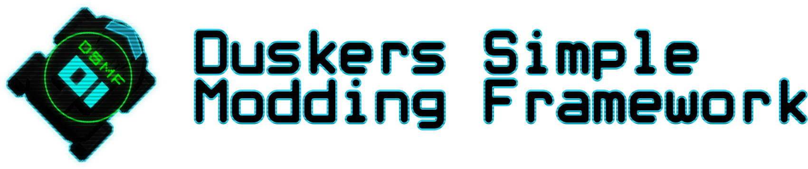

# 
A simple, but complete modding framework that allow anyone to create mods for duskers without needing to use Harmony patches to get their mod up and running.

This project makes use of [Unity Mod Manager](https://github.com/newman55/unity-mod-manager)

## What can DSMF do for you?
DSMF provides you with a complete API to add new contents into the game! In our current API we provide you the following features:
- Custom commands, with an easy to use command registry you can create and add new commands into the game;
- Custom drone upgrades, add custom drone upgrades into the game without needing to care about the complex inner workings of the game;
- Custom modifications, enhance the modifications menu by adding your own modifications that can be brought wth scraps;
- Custom game events, make new scary and fun game events to haunt players;

By using DSMF to add features into the game we can reduce the chances of incompatible mods removes the necessity of patching the game for trivial tasks.
## Getting started
DSMF requires UMM to be loaded, which means any mod that uses DSMF will be required to be an UMM mod too! Checkout the [UMM Wiki](https://wiki.nexusmods.com/index.php/How_to_create_mod_for_unity_game#Loading_custom_textures_or_predefined_assets.) to get started creating your own mod.

Creating a mod from scratch can be hard, feel free to use our examples [here](https://github.com/juanmuscaria/DSMFramework/tree/rewrite/Examples) to get an idea of how to build your own mod.
if you are already familiar with how to create mods, download the latest release [here](https://github.com/juanmuscaria/DSMFramework/releases). Inside DSMFramework.zip will be the mod, you can add it as dependency on your project.

## Installing DSMF
DSMF is an UMM mod, which will require you to download and install the modloader to be able to install DSMF. To install UMM checkout their [instructions](https://www.nexusmods.com/site/mods/21), click the mirror dropdown to download the modloader.

After installing it download DSMF from [here](https://github.com/juanmuscaria/DSMFramework/releases), you can just drag and drop the zip inside UMM Mods tab.