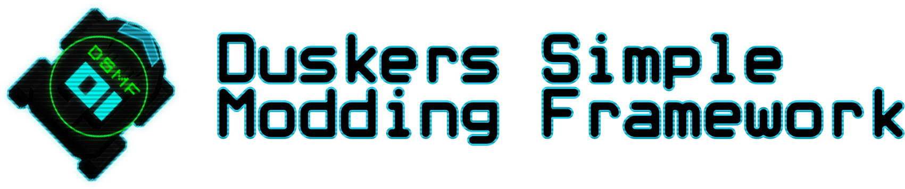

# 
A simple, but complete modding API that allow anyone to create mods for duskers without needing to heavily patch the game.

## What can DSMF do for you?

DSMF provides you with a complete API to add new contents into the game! In our current API we provide you the following features:
- Custom commands, with an easy to use command registry you can create and add new commands into the game;
- Custom drone upgrades, add custom drone upgrades into the game without needing extensive patches to keep save consistency and incompatiblity with other mods;
- Custom modifications, enhance the modifications menu by adding your own modifications that can be brought wth scraps;
- Custom game events, make new scary and fun game events to haunt players;

By using DSMF to add features into the game you can reduce the chances of incompatible mods, removing the necessity of patching the game for trivial tasks.

## Getting started

Creating a mod from scratch can be hard, feel free to use our examples [here](https://github.com/juanmuscaria/DSMFramework/tree/rewrite/Examples) to get an idea of how to build your own mod.
if you are already familiar with how to create mods, download the latest release [here](https://github.com/juanmuscaria/DSMFramework/releases). Inside DSMFramework.zip will be the mod assemblies, you can add it as dependency on your project.

## Installing DSMF
DSMF is a [BepInEx](https://github.com/BepInEx/BepInEx/) plugin packed as a [Duskers Mod Manager](https://github.com/juanmuscaria/DuskersModManager) mod, I strong recommend using the Mod Manager to manage and load mods, it is as easy as dropping the mod zip inside the mods folder and enabling it. For manual installation, create a new folder for it in the BepInEx plugin directory, unpack DSMF's package and copy everything from the package's plugin folder into the folder you just created.

## Useful links
- [DSMF Documentation](https://github.juanmuscaria.com/DSMFramework/)